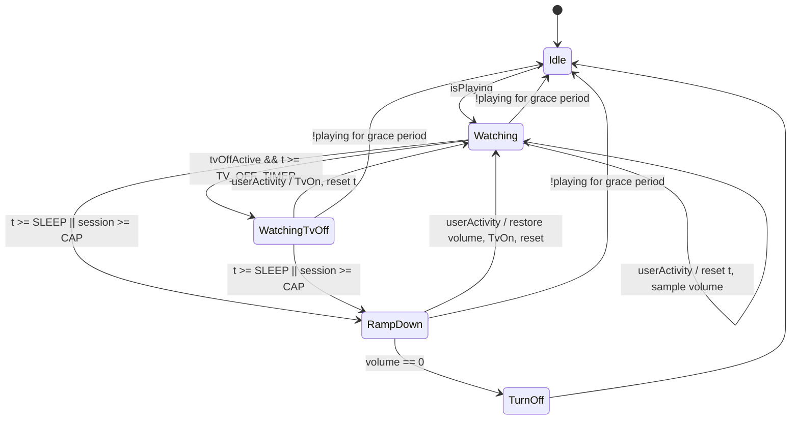

# service.sleeptimer 3.0.3

A Kodi sleep timer for falling asleep in front of a movie: it fades the volume
out instead of cutting playback dead, and it can switch the TV off early while
the audio keeps running.

## 3.0.3 fixes the "TV on all night" bug

The overnight log showed the sleep timer being reset roughly every 20 minutes
and never reaching 45:

```
00:38:33  onPlayBackStarted  -> Idle -> Watching
00:58:22  onPlayBackStarted  -> user activity -> timer reset
01:17:48  onPlayBackStarted  -> user activity -> timer reset
01:36:27  onPlayBackStarted  -> user activity -> timer reset
...
```

**Cause.** `onPlayBackStarted`, `onAVStarted` and `Player.OnPlay` were treated
as user activity. Kodi auto-advances playlists, so with ~20-minute files those
events fired every ~20 minutes forever. The longest gap between two resets all
night was 44.6 min — just under the 45-minute threshold. The 2-minute test
passed only because it fitted inside a single file.

**Fix.** Playback lifecycle events are no longer user activity. Starting
playback from `Idle` still begins a session; inside a running session a new file
just continues it.

| Event | Resets the timer? |
|---|---|
| Seek, seek chapter | yes |
| Pause, resume | yes |
| Speed change | yes |
| Volume change by the user | yes |
| Screensaver / DPMS deactivated | yes |
| Key press via the bundled keymap | yes |
| Global idle time dropping | yes |
| **`onPlayBackStarted` / `onAVStarted` / `Player.OnPlay`** | **no — playlist advance** |
| **Volume writes by the fade-out itself** | **no** |

There is also a new optional **maximum session length**: a hard cap measured
from the start of playback that no interaction can extend. It exists precisely
so that a mistake of this class can never again keep the TV on all night.

## Your TV-off command must change

The old setting was:

```sh
while ! cec-ctl -S | grep -q "Standby"; do ir-ctl -S nec:0x408 -d /dev/lirc0; sleep 30; done
```

That is dangerous with a toggle-only power button, for three separate reasons:

1. **It re-sends the toggle forever.** Once the TV is off, CEC usually stops
   answering, so `grep -q Standby` never succeeds and the loop keeps firing the
   power code: off, on, off, on all night.
2. **It cannot be cancelled.** It runs outside Kodi, so when you wake up the
   addon sends CEC TV-on while the orphaned loop is still trying to switch off.
3. **It can deadlock.** The addon launched it with `stdout=PIPE` and never read
   the pipe. `cec-ctl -S` is chatty; once it fills the 64 KB pipe buffer the
   process blocks forever mid-loop.

The retry logic now lives inside the addon, where it is bounded and cancellable.
Split your command into two settings:

| Setting | Value |
|---|---|
| Command type | Shell command |
| TV off command | `ir-ctl -S nec:0x408 -d /dev/lirc0` |
| Verify command | `cec-ctl -S \| grep -q Standby` |
| Maximum retries | `3` |
| Retry interval | `30 s` |

The worker sends the code once, waits, runs the verify command, and re-sends at
most *Maximum retries* times. **If no verify command is set, the code is sent
exactly once** — the only safe default for a toggle. Any pending retry is
cancelled the instant you wake up or the session ends, and every subprocess gets
`DEVNULL` plus a kill-on-timeout.

## Behaviour

With `Sleep after = 45 min` and `Switch TV off after = 10 min`:

```
0:00  playback starts, timer resets
10:00 IR power code sent once, audio continues
45:00 OSD notification, volume fades (-7 points every 5 s)
46:15 volume 0 -> playback stopped, screensaver on, volume restored
```

## State machine



Two clocks:

- `t` — resets on genuine user activity. Drives the sleep and TV-off thresholds.
- `session` — resets only when a session begins (or a ramp is aborted). Drives
  the optional hard cap and cannot be starved by interaction.

### Invariants

| Invariant | Why |
|---|---|
| Playback lifecycle events never reset `t` | The 3.0.3 bug: playlist advance kept the timer alive forever |
| `session` is immune to user activity | A hard cap that interaction cannot extend |
| `t` resets only on genuine interaction | Pause, seek, volume, keys, screensaver wake |
| `savedVolume` is sampled only in `Watching`/`WatchingTvOff` | Sampling during the ramp would save an already-reduced value |
| Entering `Idle` restores `savedVolume` and cancels pending TV-off | Makes every abnormal exit safe |
| `tvIsOff` gates every power-code send | The IR code is a toggle; a second send switches the TV back on |
| Retries only with a verify command, and always bounded | Unbounded retries on a toggle are catastrophic |
| The fade-out's own volume writes are filtered from activity | Otherwise the ramp resets its own timer |
| `TV_OFF_TIMER >= SLEEP` is treated as disabled | Removes the undefined equality case |

## Diagnosing the next failure

Turn on **Verbose logging**. Every few minutes the service writes:

```
[service.sleeptimer] heartbeat: state=Watching t=1320s remaining=1380s session=4021s
```

so a log immediately answers "how far did the timer get" instead of only showing
resets. Activity decisions are logged on both sides:

```
[service.sleeptimer] activity: seek(-10000)
[service.sleeptimer] ignored (not user activity): onPlayBackStarted (playlist advance)
[service.sleeptimer] ignored own volume change (68)
```

## Settings

### Timers
| Setting | Default | Range |
|---|---|---|
| Enable sleep timer | on | — |
| Sleep after | 45 min | 1–180 |
| Switch TV off after | 0 (off) | 0–180 |
| Maximum session length | 0 (off) | 0–480, step 10 |
| Volume reduction per step | 7 points | 1–50 |
| Step interval | 5 s | 1–60 |
| Notify when fade-out starts | on | — |

### TV commands
| Setting | Default |
|---|---|
| Command type | Shell command |
| TV off command | *(empty)* |
| TV on command | *(empty — falls back to `CECActivateSource`)* |
| Verify command | *(empty — send exactly once)* |
| Maximum retries | 3 |
| Retry interval | 30 s |
| Command timeout | 15 s |

### Advanced
| Setting | Default |
|---|---|
| Playback stop grace period | 60 s |
| Delay before restoring the volume | 5 s |
| React to | Video only |
| Heartbeat interval | 300 s |
| Verbose logging | off |

## Tests

`statemachine.py` imports no `xbmc`, so everything is testable offline:

```sh
python3 -m unittest discover -s tests -v
```

`tests/test_logreplay.py` replays the actual failed overnight session
transcribed from `kodi.log`. It asserts both that the old semantics never sleep
(reproducing the bug) and that the new semantics shut down correctly.

## Files

```
service.sleeptimer/
├── addon.xml
├── service.py                       1 s tick loop, playback detection
├── README.md
├── resources/
│   ├── settings.xml
│   ├── icon.png
│   ├── lib/
│   │   ├── statemachine.py          pure machine, no xbmc import
│   │   ├── kodiio.py                settings + actuators
│   │   ├── activity.py              activity classification
│   │   └── tvpower.py               cancellable, bounded TV-off worker
│   └── language/
│       ├── resource.language.en_gb/strings.po
│       └── resource.language.de_de/strings.po
└── tests/
    ├── test_statemachine.py         17 unit tests
    └── test_logreplay.py            4 tests replaying the real log
```

## Remaining hardware caveats

- **The power code is a toggle.** Everything rests on `tvIsOff` being correct.
  If CEC TV-on fails and you configure the IR toggle as the on-command too, a
  mis-tracked flag will switch the TV off instead of on.
- **Some TVs wake from CEC traffic** when Kodi stops playback or starts the
  screensaver. If the TV comes back on at the end of the cycle, that is why.
- **Kodi's volume scale is non-linear**, so a 7-point step is not a 7 % change
  in perceived loudness; the fade sounds faster near the end.

## Changelog

### 3.0.3
- Playlist advancement no longer resets the sleep timer *(the overnight bug)*
- TV-off retries moved into the addon: bounded, verifiable, cancellable
- Subprocesses use `DEVNULL` and a kill-on-timeout instead of an unread `PIPE`
- New optional maximum session length (hard cap)
- New heartbeat logging with remaining time
- Exception-safe settings access so an addon reload cannot kill the service

## License

GPL-2.0-only
