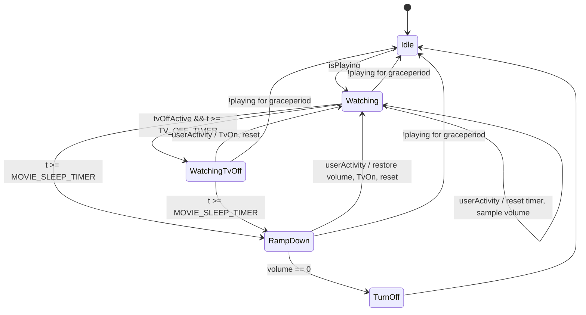

# service.sleeptimer 2.0.0

A Kodi sleep timer for falling asleep in front of a movie.

Instead of cutting playback dead at a fixed time, it fades the volume out
gradually so you still have a chance to intervene, and it can switch the TV off
early while the audio keeps running — which is the whole point if you fall
asleep listening rather than watching.

## Behaviour

With the defaults `MOVIE_SLEEP_TIMER = 45 min` and `TV_OFF_TIMER = 10 min`:

```
0:00  playback starts, elapsed timer resets
10:00 IR TV-off command sent once, audio continues
45:00 OSD notification, volume fades out (-7 points every 5 s)
46:15 volume 0 -> playback stopped, screensaver on, volume restored
```

Any user interaction (pause, seek, navigation, volume change, screensaver
wake-up) restarts the elapsed timer from zero and switches the TV back on if it
had already been turned off.

`TV_OFF_TIMER = 0` disables the early TV-off stage; the TV then goes off
together with playback at the end of the sleep time.

## State machine



### Invariants

| Invariant | Why it matters |
|---|---|
| `t` is a single elapsed timer, reset only on entry to `Watching` | Both thresholds are relative to the start of the session, so `TV_OFF_TIMER = 10` really means "10 minutes after playback started" |
| `savedVolume` is sampled only in `Watching` / `WatchingTvOff` | Sampling during the ramp would overwrite it with an already-reduced value and "restore" would leave you at near-silence |
| Entering `Idle` always restores `savedVolume` | Makes every abnormal exit (stopped movie, addon disabled, Kodi shutdown) safe |
| `tvIsOff` gates every TV-off command | The IR command is a **toggle**; sending it twice would switch the TV back on and leave it on all night |
| The ramp's own volume writes are filtered out of activity detection | Otherwise the ramp looks like the user turning the volume down and the timer resets forever |
| `TV_OFF_TIMER >= MOVIE_SLEEP_TIMER` is treated as disabled | Removes the undefined equality case without needing a warning or a clamp |

### States

- **Idle** — nothing relevant playing. Restores the saved volume on entry and
  clears all session state.
- **Watching** — playback running (including paused), TV on. Continuously
  samples the volume so the user stays in control of it.
- **WatchingTvOff** — TV switched off, audio continues. The IR command is sent
  exactly once on entry, never repeated.
- **RampDown** — volume reduced by `VOLUME_REDUCTION_PERCENT` percentage points
  every `volume_reduction_interval` seconds. An OSD notification is shown on
  entry, before the first reduction, so it is readable even though the TV may
  already be off.
- **TurnOff** — sends the IR TV-off command if it has not been sent yet, stops
  playback, activates the screensaver, waits `volume_restore_delay` seconds so
  restoring the volume stays silent, restores the volume, returns to `Idle`.
  Waking up afterwards is just Kodi's normal screensaver deactivation, which
  turns the TV back on over CEC.

## Activity detection

Kodi's global idle timer alone is not dependable — it is reset by events that
are not user interaction, and on some platforms remote key presses that go
straight into the player do not touch it. Three independent sources are
therefore combined and latched:

1. **`xbmc.Player` callbacks** (primary): `onPlayBackPaused`,
   `onPlayBackResumed`, `onPlayBackSeek`, `onPlayBackSeekChapter`,
   `onPlayBackSpeedChanged`, `onAVStarted`. This covers
   `KodiPlayer.SeekForward`, `KodiPlayer.Pause` and friends.
2. **`xbmc.Monitor` callbacks**: `onScreensaverDeactivated`,
   `onDPMSDeactivated`, and `onNotification` for `Player.On*` and
   `Application.OnVolumeChanged`.
3. **`xbmc.getGlobalIdleTime()`** as a fallback: only a *decrease* in the idle
   counter is treated as a signal. The absolute value is ignored.

Playback state comes from `Player.GetActivePlayers` (JSON-RPC) with
`xbmc.Player` as a cross-check, not from the idle timer.

A short interruption of playback does not end the session — playback must be
absent for `stop_grace_period` seconds (default 60) before the machine returns
to `Idle`. This keeps the next episode, a re-buffering stream, or a quick trip
to the library from tearing the session down.

## Settings

### Timers
| Setting | Default | Range |
|---|---|---|
| Enable sleep timer | on | — |
| Sleep after | 45 min | 5–180, step 5 |
| Switch TV off after | 0 (off) | 0–180, step 5 |
| Volume reduction per step | 7 points | 1–50 |
| Step interval | 5 s | 1–60 |
| Notify when fade-out starts | on | — |

### TV commands
| Setting | Default | Notes |
|---|---|---|
| TV off command | *(empty)* | Empty disables the early TV-off stage entirely |
| TV on command | *(empty)* | Empty falls back to `CECActivateSource` |
| Command type | Kodi builtin | Or shell command |

Examples — Kodi builtin:

```
System.Exec(/usr/local/bin/tv-off.sh)
```

Shell command mode:

```
irsend SEND_ONCE samsung KEY_POWER
```

### Advanced
| Setting | Default |
|---|---|
| Playback stop grace period | 60 s |
| Delay before restoring the volume | 5 s |
| React to | Video only / Any playback |
| Verbose logging | off |

## Installation

```
cd ~/.kodi/addons
unzip service.sleeptimer-2.0.0.zip
```

Then restart Kodi and enable the addon under
*Settings → Add-ons → My add-ons → Services → Sleep Timer*.

## Files

```
service.sleeptimer/
├── addon.xml
├── service.py                       service entry point, 1 s tick loop
├── README.md
├── LICENSE
├── resources/
│   ├── settings.xml
│   ├── icon.png
│   ├── lib/
│   │   ├── __init__.py
│   │   ├── statemachine.py          pure state machine, no xbmc import
│   │   ├── kodiio.py                settings + actuators (JSON-RPC, builtins)
│   │   └── activity.py              Player/Monitor callbacks, idle fallback
│   └── language/
│       ├── resource.language.en_gb/strings.po
│       └── resource.language.de_de/strings.po
└── tests/
    └── test_statemachine.py         20 offline tests, no Kodi needed
```

`statemachine.py` deliberately contains no `xbmc` import. All Kodi contact goes
through the injected `io` object, which is what makes the machine testable:

```
python3 -m unittest discover -s tests -v
```

## Known hardware caveats

- **The IR off command is a toggle.** Everything depends on `tvIsOff` being
  correct. If the CEC on-command ever fails and you fall back to the IR toggle
  for switching on, a mis-tracked flag will switch the TV *off* instead of on.
- **Some TVs wake up from CEC traffic** when Kodi stops playback or activates
  the screensaver. If your TV switches itself back on at the end of the sleep
  cycle, this is the cause — test it early.
- **Kodi's volume scale is non-linear** (dB-mapped). A 7-point step is not a
  7 % change in perceived loudness; the fade sounds faster at the end. Adjust
  the step size to taste.

## Changelog

### 2.0.0
- Rewritten as an explicit state machine with a single elapsed timer
- Optional early TV power-off while audio continues
- IR TV-off sent exactly once per off-transition (toggle-safe)
- Additive volume ramp, saved-volume restore on every exit path
- Activity detection via Player callbacks plus idle time as a fallback
- OSD notification when the ramp starts
- Offline unit tests

## License

MIT
